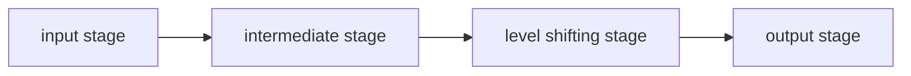

TODO

## Sources

1. Differential Amplifiers (Lecture Slides)

## Operational Amplifiers

- What are operational amplifiers?
	- A direct coupled amplifier in an integrated circuit that has high gain. External feedback networks control its response.
	- It is used for mathematical operations like addition, subtraction, integration, and differentiation.
- Operational amplifier symbols
	- $V-$ - the inverting terminal
	- $V+$ - the non-inverting terminal
- Operational amplifier equivalent circuit
	- Ideal circuit
		- $V_{o} = Av_{d}$
		- $v_{d}=v_{+}-v_{-}$
		- A - open loop gain

## The Typical Operational Amplifier Block Diagram

1. The **input stage** is often made up of a differential amplifier with dual inputs and a balanced output.
2. The **intermediate stage** is also made up of a differential amplifier with dual-input, but has an *unbalanced* output 
3. The **level shifting stage** can be an emitter follower with either a current mirror, constant current bias, or a voltage divider.[^2]
4. The **output stage** is typically a complementary symmetry push-pull amplifier.

## Operational Amplifier Parameters

1. Input bias current $I_{b}$
	- Is the average of the currents flowing through the two inputs. 
	- Ideally the two currents have the same magnitude.
	- It is needed by the operational amplifier to work properly during the input stage.
	- Problems arise when the operational amplifier operates in high dc applications.
	- $I_{B}=\frac{I_{B}+{I_{B-}}}{2}$
	- Minimizing the effects of $I_{b}$
		- Put a **dummy resistance** at the positive terminal that the same magnitude as the Thevenin resistance found in the negative terminal.
		- Use a **super-beta transistor** at the input stage. 
			- Its thin base results in high gain.
		- Use **input current cancellation**.
			- Dummy resistance unnecessary when this is used.
		- Use very **low input bias current** (like FETs and MOSFETs).
2. Input offset current $I_{OS}$
	- Is the difference between the input bias currents ($I_{os}=I_{B+}-I_{B-}$).
	- Errors also exists at high dc applications.
	- Reducing all resistances can eliminate it because it will increase power dissipation and generate harmonic distortion.
3. Input offset voltage $V_{OS}$
	- The transistor mismatches prevents the output from becoming zero when the input is equal to zero. Nonetheless, ==the input offset voltage refers to the amount of voltage applied to one of the input terminals to obtain a zero output voltage.==
	- $V_{os}=\left(1+\frac{R_{2}}{R_{1}} \right)V_{io}$
4. Input voltage range $V_{cm}$
	- The range of input voltages where the operational amplifier can still work properly.
		- For BJT, this is the range of input voltages where it still operates in the *forward active region*.
5. Output voltage swing $\pm V_{omax}$
	- Depends on the load resistance.
	- The limit of output voltage that the operational amplifier can push without clipping or saturation
	- $V_{OL}\leq V_{O}\leq V_{OH}$
		- $V_{OH}\cong V_{CC}-0.9V$
		- $V_{OL}\cong V_{EE}+2.1V$
	- **CMOS operational amplifiers** can give rail-to-rail outputs—their output ranges up to $V_{CC}$ and down to $V_{EE}$.
6. Output short circuit current $I_{OSC}$
	- Maximum output current that the operation amplifier can supply the load
7. Input resistance $Z_{i}$
	- The *intrinsic resistance* that looks into one of the inputs while the other input is grounded.
8. Output resistance $Z_{oi}$
	- The resistance that looks into the output of operational amplifiers.
9. Supply current
	- The current the operational amplifier extracts from the power supply.
10. Open-loop voltage gain $A_{ol}$
	- Ratio of the operational amplifier's output voltage to input voltage with no external feedback
	- Gain and frequency has an inverse relationship (i.e. gain decreases when frequency grows)
11. Unity gain bandwidth product $GBP$
	- The frequency where the $A_{ol}$ goes down to 1 or 0 dB.
	- $f_{max}=\dfrac{GBW}{A_{vcl}}$
12. Common-mode rejection ratio $CMRR$
	- Measures the capacity of an operational amplifier to reject signals that are present at both inputs at the same time.
	- The ratio of the common-mode input voltage to the generated output voltage.
	- Can and typically expressed in dB.
13. Slew rate $SR$
	- The output voltage's time rate of change with a unity voltage gain.
14. Channel separation for packages with one internal operational amplifiers
	- There will be some amount of crosstalk.[^1]

## Loop Configurations

- Open-loop 
	- for oscillator circuits and comparison
- Closed loop
	- for amplifiers and similar uses
	- It has an external component attached between the input and output of the operational amplifier.

## Types of Operational Amplifiers

- Compensated operational amplifier
	- Internal compensation is used to minimize the instability in the amplifier.[^3]
		- The circuit will oscillate when the total phase lag is 360 degrees
	- An RC circuit with limited high frequency gain and slew rate.
	- -20dB/decade constant roll-off rate from unity gain to fc.
- Uncompensated operational amplifier
	- Needs an external RC circuit, and, as a result, potentially increasing frequency range of operation.
	- Frequency response depends on the individual responses of several internal stages.

## Responses

- Frequency response
	- Demonstrates the change in voltage gain as frequency also changes.
- Phase response
	- One RC network can lead to a phase shift of up to -90 degrees.
	- Compensated operational amplifiers are more stable because the phase lag stay below 90 degrees.
	- The phase lag in an uncompensated operational amplifier is determined by the total number of stages (more stages more phase lag).
		- Total phase lag is given by the following equation:
			- $\phi_{\text{tot}}=-\tan^{-1}\left(\frac{f}{f_{c_{1}}}\right)-\tan^{-1}\left(\frac{f}{f_{c_{2}}}\right)-\dots-\tan^{-1}\left(\frac{f}{f_{c_{n}}}\right)$

[^1]: Crosstalk will occur when a signal applied to the input of the operational amplifier section results in a small output signal in the remaining section(s), despite the lack of input signal applied to unused section(s).

[^2]: An emitter follower has high input impedance and low output impedance. 

[^3]: Instability is a result of feedback lag.
