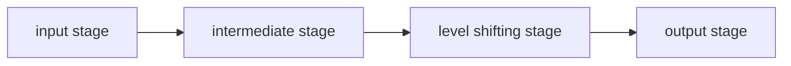

TODO

## Sources

1. Differential Amplifiers (Lecture Slides)

## Operational Amplifiers

- What are operational amplifiers?
	- A direct coupled amplifier in an integrated circuit that has high gain. External feedback networks control its response.
	- It is used for mathematical operations like addition, subtraction, integration, and differentiation.
- Operational amplifier symbols
	- $V-$ - the inverting terminal
	- $V+$ - the non-inverting terminal
- Operational amplifier equivalent circuit
	- Ideal circuit
		- $V_{o} = Av_{d}$
		- $v_{d}=v_{+}-v_{-}$
	- Practical circuit
		- A - open loop gain

## The Typical Operational Amplifier Block Diagram

1. The **input stage** is often made up of a differential amplifier with dual inputs and a balanced output.
2. The **intermediate stage** is also made up of a differential amplifier with dual-input, but has an *unbalanced* output 
3. The **level shifting stage** can be an emitter follower with either a constant mirror, constant current bias, or a voltage divider.
4. The **output stage** is typically a complementary symmetry push-pull amplifier.

## Operational Amplifier Parameters

1. Input bias current $I_{b}$
	- The direct current found at the inputs, which are necessary for proper operation of the input stage.
	- The average of the two currents flowing through the inputs. Ideally, these two currents are equal.
		- $I_{B}=\frac{I_{B}+{I_{B-}}}{2}$
	- High dc applications give rise to errors.
	- Minimizing the effects of $I_{b}$
		- Use a **dummy resistance** at the positive terminal equivalent to the Thevenin resistance at the negative terminal
		- Use a **super-beta transistor** at the input stage
		- Use **input current cancellation**
		- Use very **low input bias current**
2. Input offset current $I_{OS}$
	- Is the difference between the input bias currents ($I_{os}=I_{B+}-I_{B-}$)
	- Generates error at high dc applications
	- Reducing all resistances can eliminate it because it will increase power dissipation and generate harmonic distortion
3. Input offset voltage $V_{OS}$
	- The transistor mismatches prevents the output from becoming zero when the input is equal to zero. Nonetheless, ==the input offset voltage refers to the amount of voltage applied to the input terminals to obtain a zero output voltage.==
	- $V_{os}=\left(1+\frac{R_{2}}{R_{1}} \right)V_{io}$
4. Input voltage range $V_{cm}$
	- The range of input voltages where the operational amplifier can still work properly.
	- For BJT, this is the range of input voltages where it still operates in the *forward active region*.
5. Output voltage swing $\pm V_{omax}$
	- Depends on the load resistance.
	- The maximum output voltage that the operational amplifier can supply without clipping or saturation.
	- $V_{OL}\leq V_{O}\leq V_{OH}$
		- $V_{OH}\cong V_{CC}-0.9V$
		- $V_{OL}\cong V_{EE}+2.1V$
	- **CMOS operational amplifiers** can give rail-to-rail outputs—their output ranges up to $V_{CC}$ and down to $V_{EE}$.
6. Output short circuit current $I_{OSC}$
	- Maximum output current that the operation amplifier can supply the load
	- The transistors conduct when a large current exists at the output, and, as a result, limiting the current that would flow to the base of the output transistors.
7. Input resistance $Z_{i}$
	- The *intrinsic resistance* whereby it looks in at either input with the remaining input grounded.
8. Output resistance $Z_{oi}$
	- In contrast to input resistance, this resistance looks into the output of operational amplifiers instead.
9. Supply current
	- The current extracted from the power supply.
10. Open-loop voltage gain $A_{ol}$
	- Ratio of the operational amplifier's output voltage to input voltage with no external feedback
	- Gain and frequency has an inverse relationship (i.e. gain decreases when frequency grows)
11. Unity gain bandwidth product $GBP$
	- The frequency where the open loop voltage gain goes down to 1 or 0 dB.
	- $f_{max}=\dfrac{GBW}{A_{vcl}}$
12. Common-mode rejection ratio $CMRR$
	- Measures the capacity of an operational amplifier to reject signals that are present at both inputs at the same time.
	- The ratio of the common-mode input voltage to the generated output voltage.
	- Can and typically expressed in dB.
13. Slew rate $SR$
	- The output voltage's time rate of change, wherein the operational amplifier has a voltage gain of unity.
14. Channel separation for packages with one internal operational amplifiers
	1. There will be some amount of crosstalk.[^1]

[^1]: The signal applied to the input of the operational amplifier section will develop a small output signal in the remaining section(s) despite the lack of input signal applied to unused section(s).
