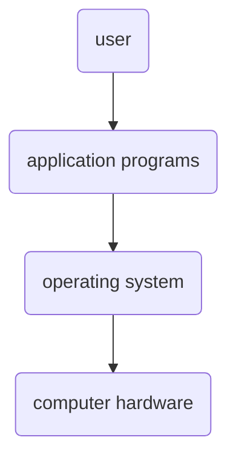

## Sources

1. Chapter 01 Introduction (Lecture Slides)

## Operating Systems

Operating systems are programs that facilitate the interaction between computer users and their computers. Furthermore, they allow users to run programs that assist them in solving their problems. The relationship between operating systems, hardware, and users are illustrated in the figure below.

The uses of operating systems vary depending on the type of device and its users:

- Shared computers have operating systems that serve as *resource allocators* to efficiently utilize HW by controlling programs.
- Dedicated systems often harness shared resources from servers.
- Mobile devices, despite its low resources, are designed for usability and long lasting battery life. In addition, their interfaces might include touch screens, voice recognition, and etc.
- Embedded computers barely have any user interface or none at all (it mostly does not need user intervention).

The kernel—the only program in the computer that runs at all times—is the most common way of defining operating systems. The other types of programs found in the computer are the *system program* and the *application program*.

> [!INFO]
> - **System program:** All programs that are connected with the operating system but not the kernel.
> - **Application program:** All programs not connected with the operating system.

Modern operating systems also have *middleware*, or software frameworks built for developers.

## Computer System

> [!INFO] Computer System Structure
>
> 1. Hardware
> 2. Operating System
> 3. Application Programs
> 4. Users

Computer system
